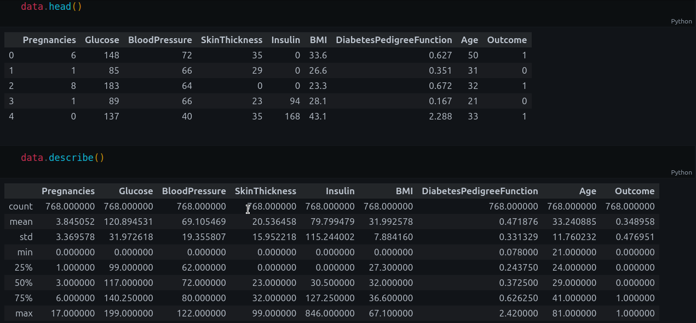
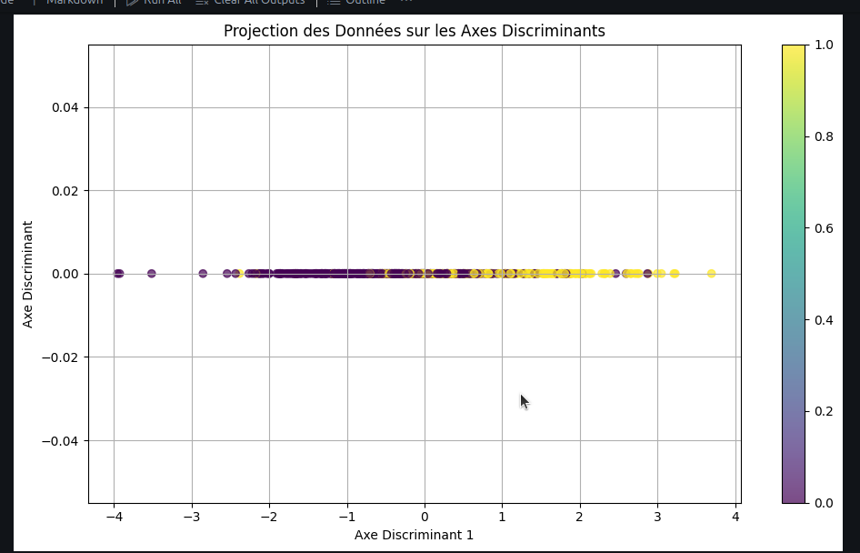
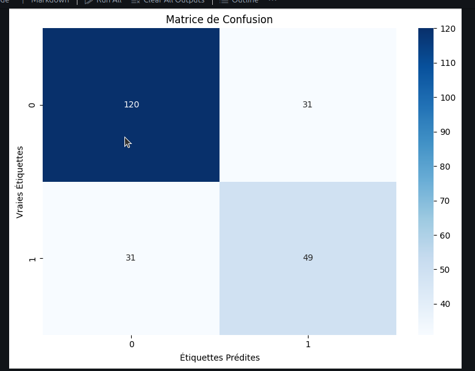
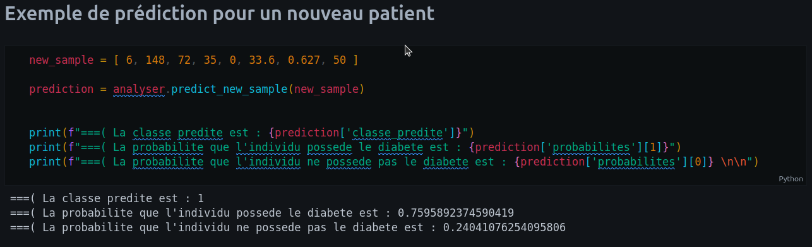

  

<h1 align="center">Analyse-des-facteur-discriminant-les-patients-diabetiques-des-nons-diabetiques-en-utilisant-l'analyse-factorielle-discriminante (AFD)</h1>

---

 
Dans ce cas concret, nous appliquons l’analyse factorielle discriminante (AFD) à un jeu
de données réel extrait du fichier diabetes.csv. Ce jeu de données est largement utilisé
dans le domaine médical pour étudier le diabète. Il contient plusieurs variables quantita-
tives telles que la glycémie, l’indice de masse corporelle (IMC), la pression artérielle, ainsi
que d’autres paramètres biologiques.
Les observations représentent des patients, et une variable qualitative indique l’appar-
tenance à l’une des classes suivantes :

**Diabétique** et **Non-diabétique**
####
L’objectif est de comprendre quelles variables discriminent le mieux les patients dia-
bétiques des non-diabétiques et de visualiser cette séparation dans un espace réduit.
      

## 📝 Table of Contents

- [Presentation du projet](#about)
- [Demo du projet](#etape)
- [Presentation du jeu de données utilisé](#donne)
- [Illustrations et représentations graphiques](#usage)
- [Guide d'utilisation](#doc)

## 🧐 Presentation du projet 

Le problème réel que nous souhaitons résoudre est le suivant :  
— `Identifier les variables discriminantes `: Déterminer quelles mesures (par exemple,
glycémie, IMC, etc.) jouent un rôle crucial dans la classification des patients en dia-
bétiques ou non-diabétiques.  
— `Réduire la dimensionnalité` : À l’aide de l’AFD, projeter les données dans un
espace de dimension réduite tout en maximisant la séparation entre les deux classes.  
— `Faciliter l’interprétation et la prise de décision` : En visualisant les axes discri-
minants, il devient plus aisé de comprendre la structure sous-jacente des données et
d’appuyer la prise de décisions cliniques ou de poursuivre des analyses prédictives.

## 🎥 Etape du projet 

1. `Prétraitement des données` :  
— **Chargement et nettoyage du fichier diabetes.csv**.  
— **Sélection des variables pertinentes et standardisation des données pour har-
moniser les échelles**.  
2. `Calcul des matrices de variance` :  
— **Calcul de la matrice des variances intra-groupes (SW )**.  
— **Calcul de la matrice des variances inter-groupes (SB )**.  
3. `Optimisation et extraction des axes discriminants` : Résolution du problème
d’optimisation visant à maximiser le critère de Fisher,
ce qui permet d’obtenir les vecteurs propres correspondant aux axes discriminants.
4. `Projection et visualisation` : Projection des données sur les axes discriminants
afin de visualiser la séparation entre les classes.
5. `Interprétation des résultats` : Analyse de la contribution des variables et discus-
sion sur leur pouvoir discriminant dans le contexte du diagnostic du diabète.
Cette approche permettra de vérifier l’efficacité de l’AFD pour distinguer les patients
selon leur état diabétique et de mettre en évidence les variables les plus influentes pour
ce type de classification.

## 🎈 Presentation du jeu de données utilisé 
Le jeu de données, par exemple issu du fichier diabetes.csv, ayant 768 lignes et
comporte les attributs suivants :  
— `Pregnancies` : **Nombre de grossesses effectuées par la patiente.**  
— `Glucose` : **Niveau de glucose dans le sang (mg/dL).**  
— `BloodPressure` : **Pression artérielle (mm Hg).**  
— `SkinThickness` : **Épaisseur de la peau, généralement mesurée au niveau des triceps
(mm).**  
— `Insulin` : **Niveau d’insuline dans le sang (mu U/mL).**  
— `BMI` : **Indice de Masse Corporelle, calculé à partir du poids et de la taille.**  
— `DiabetesPedigreeFunction` : **Fonction de pédigrée diabétique, reflétant la proba-
bilité génétique du diabète.**  
— `Age` : **Âge de la patiente (années).**  
— `Outcome` : **Variable cible indiquant si la patiente est diabétique (1) ou non (0)**

##  Illustrations et représentations graphiques 

## ⛏️ BGuide d'utilisation 

### Pour pour lancer le projet il est necessaire d'avoir les elements suivant :
`python3, pandas,  numpy, matplotlib, seaborn et sklearn`, 
### pour le faire executer la commande suivante apres avoir installer python3 et pip :  
*` pip install pandas numpy matplotlib seaborn sklearn `*

## Contributeur 

**WATAT YONDEP STIVE KEVIN**,  
**AZEUFACK NGNINWO THIERRY**